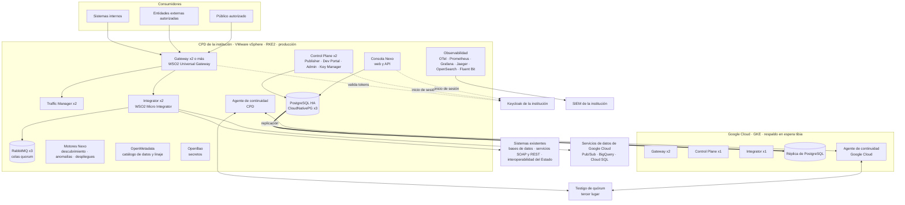
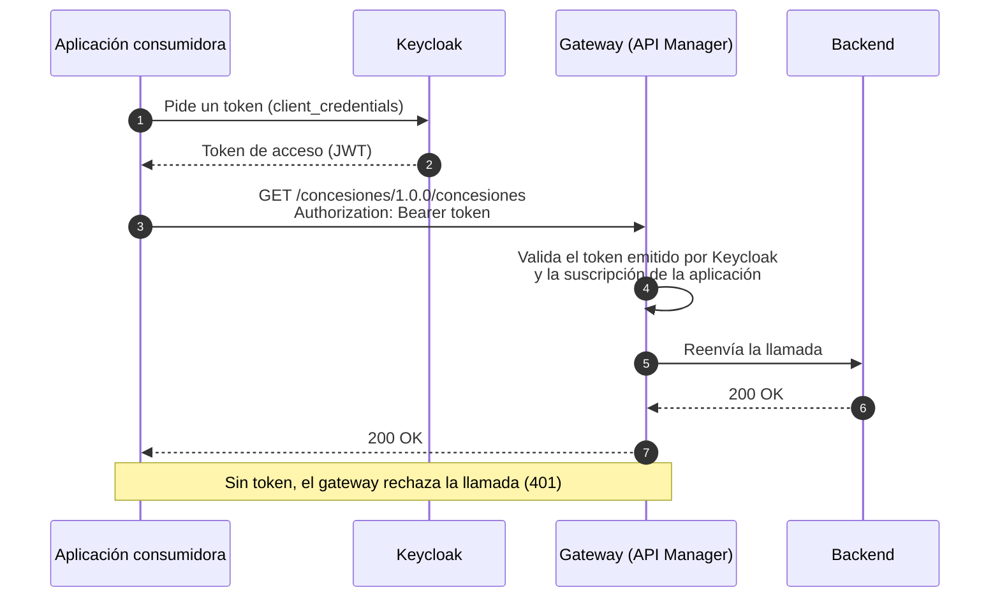

import EstadoCapacidad from '@site/src/components/EstadoCapacidad';

# Arquitectura

:::info Diseño

Esta página describe la arquitectura objetivo de Nexo. Hoy existe el [laboratorio local](./laboratorio.md) (<EstadoCapacidad id="laboratorio" />), que reúne la base en una sola máquina con Docker Compose y no representa la topología de producción. Los instaladores para Kubernetes están en estado <EstadoCapacidad id="helm" />.

:::

## Principios

- **En la infraestructura de la institución.** El centro de datos (CPD) es el sitio principal y Google Cloud es el sitio de respaldo. Nexo no es un servicio en la nube de terceros.
- **El mismo software en ambos sitios.** Los mismos charts Helm sobre Kubernetes: RKE2 en máquinas virtuales VMware vSphere en el CPD y GKE en Google Cloud.
- **La identidad de la institución.** Keycloak es el Key Manager del gateway y el inicio de sesión (OIDC) de los portales y de la Consola.
- **No reprogramar lo que ya existe.** Lo que resuelven WSO2 API Manager y Micro Integrator se configura; la capa Yago agrega lo que falta.
- **Todo cambio por revisión.** La configuración vive en Git y se promueve entre ambientes sin editar producción a mano.
- **Sin dependencia del proveedor.** APIs, contratos, políticas y flujos se exportan en formatos documentados.

## Capas

| Capa | Componentes | Función |
| --- | --- | --- |
| Exposición | Universal Gateway de WSO2 API Manager | Recibe las llamadas de los consumidores, valida los tokens y aplica las políticas de seguridad y de uso. |
| Gestión de APIs | Control Plane (Publisher, Dev Portal, Admin y Key Manager) y Traffic Manager | Ciclo de vida de cada API, portal para desarrolladores, aplicaciones, suscripciones y límites de uso. |
| Integración | WSO2 Micro Integrator y RabbitMQ | Flujos entre sistemas: transformación, orquestación, colas, manejo de errores y reproceso. |
| Datos de la plataforma | PostgreSQL en alta disponibilidad (CloudNativePG) | Bases de API Manager, Micro Integrator y Consola Nexo. |
| Capa Yago | Consola Nexo y motores Nexo | Catálogo e impacto, descubrimiento, anomalías, despliegues progresivos, continuidad, consumo y auditoría. |
| Observabilidad | OpenTelemetry Collector, Jaeger, Prometheus, Alertmanager, Grafana, OpenSearch y Fluent Bit | Trazas, métricas, alertas, logs, analítica y envío de auditoría al SIEM. |
| Seguridad transversal | Keycloak de la institución, OpenBao y TLS | Identidad, secretos y cifrado en tránsito. |

## Topología híbrida

En operación normal, todo el tráfico entra por los gateways del CPD. Google Cloud mantiene un sitio de respaldo en espera tibia, con una réplica de la base de datos. Un tercer lugar aloja el testigo de quórum.

### Continuidad entre sitios

Estado: <EstadoCapacidad id="motor-continuidad" />

- **Quórum de 2 de 3.** Un agente en el CPD, otro en Google Cloud y un testigo en un tercer lugar revisan la salud del gateway, del Control Plane, de la base de datos y de un recorrido sintético completo. Solo se conmuta si dos de los tres votos coinciden, para que los dos sitios nunca queden activos a la vez.
- **Conmutación, en orden:** cerrar la escritura en el CPD si todavía responde; promover la réplica de PostgreSQL en Google Cloud; escalar los gateways y el Integrator del sitio de respaldo; cambiar el DNS o el balanceador global; avisar a la mesa de soporte y al SIEM.
- **Retorno guiado.** La vuelta al CPD se hace con aprobación de una persona con rol aprobador, para no rebotar entre sitios.
- **Medición.** Cada conmutación registra el RTO y el RPO medidos. El modo manual y el automático usan el mismo procedimiento.

## Componentes por ambiente

| Ambiente | Dónde | Qué corre |
| --- | --- | --- |
| Desarrollo | Clúster Kubernetes no productivo (RKE2 sobre vSphere), espacio `dev` | Una réplica de cada componente. |
| QA y pruebas | Mismo clúster no productivo, espacio `qa`, con credenciales propias | Una réplica de cada componente; solo datos sintéticos. |
| Producción | Clúster RKE2 dedicado (vSphere) | Dos o más réplicas de todo lo que procesa tráfico; PostgreSQL con 3 instancias; RabbitMQ con 3 nodos. |
| DR | GKE regional en Google Cloud (región de Santiago, `southamerica-west1`) | Espera tibia: 2 gateways, 1 Control Plane, 1 Micro Integrator, réplica de PostgreSQL y agente de continuidad. |
| Testigo | Máquina virtual pequeña en un tercer lugar (otra zona de Google Cloud u otro sitio de la institución) | Solo el voto de quórum. |

- Cada ambiente tiene credenciales propias; los datos de QA son sintéticos.
- Los cambios se promueven de desarrollo a QA y a producción desde Git, con revisión, sin editar producción: <EstadoCapacidad id="gitops" conNombre />.
- El dimensionamiento (CPU, memoria, disco y red) se define con cada institución según su carga.

## Flujo de una llamada

Este es el recorrido que hoy se verifica en el laboratorio (<EstadoCapacidad id="api-ejemplo-e2e" />): una aplicación consumidora obtiene un token de Keycloak y llama a una API publicada en el gateway.

## Capa Yago

| Pieza | Qué hace | Estado |
| --- | --- | --- |
| Consola Nexo | Interfaz web y API propias: catálogo, impacto, consumo, auditoría, continuidad, cumplimiento y administración. | <EstadoCapacidad id="consola" /> |
| Descubrimiento | Compara lo publicado en otros gateways, servidores web y servicios en la nube con el catálogo, y califica la exposición de lo no gobernado. | <EstadoCapacidad id="motor-descubrimiento" /> |
| Guardián de anomalías | Calcula líneas base por API y consumidor; alerta o bloquea mediante políticas de denegación del gateway, con duración limitada o con aprobación. | <EstadoCapacidad id="motor-anomalias" /> |
| Despliegues progresivos | Divide el tráfico entre la versión estable y la nueva por pasos, compara errores y latencia, y vuelve atrás sola si un paso falla. | <EstadoCapacidad id="motor-despliegues" /> |
| Continuidad | Agentes con quórum y procedimiento de conmutación y retorno descritos arriba. | <EstadoCapacidad id="motor-continuidad" /> |
| Instaladores | Chart Helm por ambiente, RKE2 en vSphere y GKE en Google Cloud. | <EstadoCapacidad id="helm" /> |

La API de la Consola tiene su [contrato OpenAPI](./api-consola.md) publicado.
