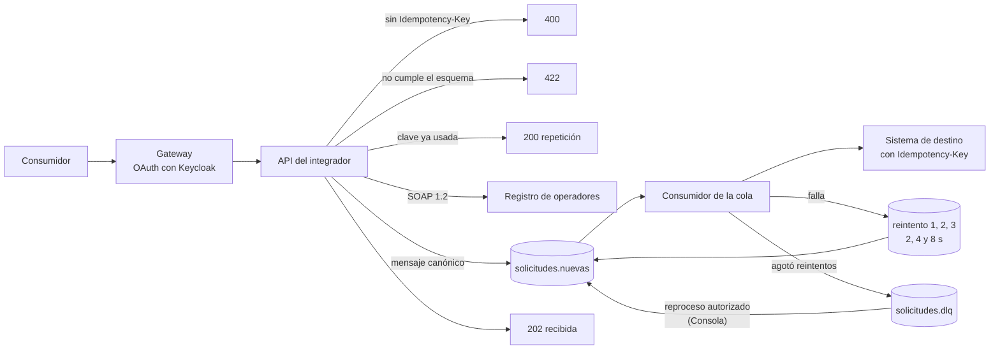

import EstadoCapacidad from '@site/src/components/EstadoCapacidad';

# M4 · Integración con Micro Integrator

**Duración:** 5 horas · **Sesión:** 5 · **Rutas:** Integración y Certificación

Estado: <EstadoCapacidad id="flujos-integracion" /> · Mensajes fallidos con reproceso: <EstadoCapacidad id="mensajes-fallidos" />

## Objetivos de aprendizaje

Al terminar el módulo, el participante:

1. Recorre los artefactos de un flujo de Micro Integrator: API, secuencias, endpoints, entrada local e inbound endpoint.
2. Explica y prueba la validación con esquema JSON, la idempotencia y la respuesta asíncrona.
3. Sigue un mensaje por las colas de reintento hasta la cola de fallidos y lo reprocesa con autorización.
4. Cambia un artefacto versionado y lo carga en el integrador del laboratorio.
5. Encuentra la traza de punta a punta de una solicitud (gateway → integrador → cola → destino).

## Agenda

| Bloque | Tiempo | Contenido |
| --- | --- | --- |
| 1 | 0:00 – 0:40 | Micro Integrator en Nexo: artefactos versionados en `wso2/mi/artifacts`, Management API, colas en RabbitMQ. |
| 2 | 0:40 – 1:20 | [Ejercicio 4.1](#ejercicio-4-1): recorrer el flujo. |
| — | 1:20 – 1:35 | Pausa. |
| 3 | 1:35 – 2:35 | [Ejercicio 4.2](#ejercicio-4-2): validación, idempotencia y respuesta asíncrona. |
| 4 | 2:35 – 3:35 | [Ejercicio 4.3](#ejercicio-4-3): falla del destino, reintentos y reproceso. |
| — | 3:35 – 3:50 | Pausa. |
| 5 | 3:50 – 4:45 | [Ejercicio 4.4](#ejercicio-4-4): cambiar un artefacto; trazas de punta a punta. |
| 6 | 4:45 – 5:00 | Cierre y autoevaluación. |

## Conceptos

### El flujo de solicitudes

La API **SolicitudesConcesion** del gateway (`https://apim:8243/solicitudes/1.0.0/`) llama al integrador (`http://mi:8290/integracion/solicitudes`). El flujo (`wso2/mi/artifacts/api/SolicitudesConcesionAPI.xml`):



1. **Recepción**: exige el encabezado `Idempotency-Key` (si falta, 400).
2. **Validación** contra el esquema JSON `EsquemaSolicitud` (si falla, 422 con el detalle).
3. **Idempotencia**: si la clave ya está en la tabla `nexo_idem` (base `mi_db`), responde 200 con la misma respuesta, `repeticion: true` y el encabezado `X-Idempotent-Replay`, sin repetir efectos.
4. **Enriquecimiento**: consulta SOAP 1.2 al registro de operadores por RUT.
5. **Transformación** a un mensaje canónico y **publicación** en RabbitMQ (`nexo.solicitudes` → `solicitudes.nuevas`).
6. **Respuesta 202** con el identificador de la solicitud y su correlación.

Un error no controlado pasa por la `faultSequence`, que responde 502 con el código y la correlación.

### Cola, reintentos y fallidos

- El inbound endpoint `SolicitudesConsumidor` consume `solicitudes.nuevas` con **confirmación manual**: el mensaje se confirma solo al terminar la mediación.
- La secuencia `procesar-solicitud` llama al sistema de destino con la `Idempotency-Key` original. Si falla, `reintentar-solicitud` publica en `solicitudes.reintento.1`, `.2` o `.3` (TTL de 2, 4 y 8 s, que devuelven el mensaje a la cola principal).
- Agotados los tres reintentos, el mensaje va a `solicitudes.dlq`. Desde la Consola, un **aprobador** lo reprocesa indicando un motivo; queda auditado.
- La alerta `ColaConMensajesFallidos` (severidad S3) se activa si la cola de fallidos tiene mensajes por más de 5 minutos.

### Artefactos versionados

`wso2/mi/artifacts` se monta en el contenedor `mi` y el entrypoint de WSO2 lo copia sobre la configuración al iniciar. Un cambio en esos archivos se carga **reiniciando el contenedor**. La Management API (puerto 9164) muestra lo que el integrador tiene cargado.

### Trazas

Gateway e integrador envían trazas OTLP al OpenTelemetry Collector, que las entrega a Jaeger (servicio `nexo-integrator` para el integrador). Con un encabezado `traceparent`, la llamada del consumidor y todo su recorrido quedan en una misma traza.

## Ejercicios de laboratorio

Cargue las ayudas en cada terminal: `source tools/lab-bootstrap/ayudas-curso.sh`.

### Ejercicio 4.1 · Recorrer el flujo {#ejercicio-4-1}

**Objetivo.** Relacionar los archivos del repositorio con lo que el integrador tiene cargado.

**Pasos.**

1. Vea lo que tiene cargado el integrador:

   ```bash
   mi_api /apis | jq '.list[] | {name, url}'
   mi_api /endpoints | jq -r '.list[] | "\(.name)  \(.type)  activo=\(.isActive)"'
   mi_api /inbound-endpoints | jq '.list[]'
   mi_api /sequences | jq -r '.list[].name'
   ```

2. Ubique cada uno en `wso2/mi/artifacts/` (carpetas `api`, `endpoints`, `inbound-endpoints`, `sequences` y `local-entries`).
3. En RabbitMQ (`http://localhost:15672`, usuario `nexo`) vea los exchanges `nexo.solicitudes`, `nexo.reintentos` y `nexo.dlq`, y las colas con sus argumentos (TTL y dead-letter de las colas de reintento).
4. Vea el contrato que publica el registro SOAP:

   ```bash
   curl -s 'http://localhost:7002/soap/registro?wsdl' | head -20
   ```

**Resultado esperado.** El integrador tiene la API `SolicitudesConcesionAPI` (contexto `/integracion/solicitudes`), los endpoints `RegistroOperadoresEP`, `ConcesionesBackendEP`, `ColaSolicitudesEP`, `ColaReintento1EP` a `3EP` y `ColaFallidosEP`, el inbound endpoint `SolicitudesConsumidor` y las secuencias `procesar-solicitud`, `reintentar-solicitud` y `error-solicitud`. Las colas de reintento muestran `x-message-ttl` de 2000, 4000 y 8000 ms. El registro responde un WSDL con la operación `ConsultarOperador` en SOAP 1.2.

**Autoevaluación.**

- ¿Qué artefacto decide cuántos reintentos hay antes de la cola de fallidos?

<details>
<summary>Respuesta</summary>

La secuencia `reintentar-solicitud`: mientras el contador de intentos es menor que 3 publica en la cola de reintento siguiente; si no, en la de fallidos. Los tiempos de espera los dan los TTL de las colas, que crea el arranque del laboratorio.

</details>

### Ejercicio 4.2 · Validación, idempotencia y respuesta asíncrona {#ejercicio-4-2}

**Objetivo.** Probar cada respuesta del flujo, primero directo al integrador y luego a través del gateway.

**Pasos.**

1. Mire el contador del sistema de destino antes de empezar:

   ```bash
   curl -s http://localhost:7001/_estadisticas
   ```

2. Envíe una solicitud nueva directo al integrador y repítala con la misma clave:

   ```bash
   K="curso-$(date +%s)"
   SOL='{"rutEmpresa":"76.086.428-5","servicio":"Internet","region":"Los Lagos"}'
   curl -s -i -X POST http://localhost:8290/integracion/solicitudes/ -H 'content-type: application/json' -H "Idempotency-Key: $K" -d "$SOL"
   curl -s -i -X POST http://localhost:8290/integracion/solicitudes/ -H 'content-type: application/json' -H "Idempotency-Key: $K" -d "$SOL"
   ```

3. Pruebe los rechazos:

   ```bash
   curl -s -X POST http://localhost:8290/integracion/solicitudes/ -H 'content-type: application/json' -d "$SOL" -w '  → %{http_code}\n'
   curl -s -X POST http://localhost:8290/integracion/solicitudes/ -H 'content-type: application/json' -H "Idempotency-Key: $K-x" \
     -d '{"rutEmpresa":"1","servicio":"X"}' -w '  → %{http_code}\n'
   ```

4. Vuelva a mirar el contador del destino unos segundos después.
5. Haga lo mismo a través del gateway con la verificación del laboratorio, que suscribe OperadorDemo a la API si hace falta:

   ```bash
   pnpm --filter @nexo/lab-bootstrap check:integracion
   ```

**Resultado esperado.** La primera llamada responde `202` con `idSolicitud`, `estado: "recibida"`, los datos del operador y la `correlacion`; la repetición responde `200` con la misma respuesta, `"repeticion": true` y el encabezado `X-Idempotent-Replay: true`. Sin clave, `400`; con datos inválidos, `422` y el detalle de la validación. El contador `registrosCreados` del destino sube en 1, no en 2. `check:integracion` muestra lo mismo a través del gateway (202, 200 y 422) y la traza con spans del gateway y del integrador.

**Autoevaluación.**

- ¿Por qué la primera respuesta es 202 y no 201?
- Si el destino recibe dos veces el mismo mensaje (por un reintento), ¿por qué no crea dos registros?

<details>
<summary>Respuestas</summary>

Porque el integrador solo deja la solicitud en la cola: el registro en el destino ocurre después, de forma asíncrona. El destino recibe la misma `Idempotency-Key` en cada intento y devuelve la respuesta ya entregada para esa clave.

</details>

### Ejercicio 4.3 · Falla del destino, reintentos y reproceso autorizado {#ejercicio-4-3}

**Objetivo.** Seguir un mensaje hasta la cola de fallidos y reprocesarlo con el rol correcto.

**Pasos.**

1. Simule la caída del sistema de destino y envíe una solicitud nueva:

   ```bash
   caos 1
   K="curso-falla-$(date +%s)"
   curl -s -X POST http://localhost:8290/integracion/solicitudes/ -H 'content-type: application/json' -H "Idempotency-Key: $K" \
     -d '{"rutEmpresa":"76.086.428-5","servicio":"Internet","region":"Los Lagos"}' | jq
   ```

2. Durante unos 20 segundos, mire las colas y el registro del integrador:

   ```bash
   curl -s -u "nexo:$RABBITMQ_PASSWORD" 'http://localhost:15672/api/queues/%2F' | jq -r '.[] | "\(.name)  \(.messages)"'
   (cd deploy/compose && docker compose --env-file .env logs --tail=80 mi) | grep -E "8-reintento-programado|9-enviado-a-fallidos"
   ```

3. Vea el mensaje en la Consola y restablezca el destino:

   ```bash
   consola luis.aprobador GET /dead-letters | jq '.[] | select(.status == "pendiente") | {id, attempts, error, payloadPreview}'
   caos 0
   ID=$(consola luis.aprobador GET /dead-letters | jq -r '[.[] | select(.status == "pendiente")][0].id | @uri')
   ```

4. Intente reprocesar sin permiso y sin motivo, y luego hágalo bien:

   ```bash
   consola_estado ana.desarrollo POST "/dead-letters/$ID/reprocess" '{"reason":"intento sin permiso"}'
   consola_estado luis.aprobador POST "/dead-letters/$ID/reprocess" '{}'
   consola luis.aprobador POST "/dead-letters/$ID/reprocess" '{"reason":"Destino restablecido; se reintenta"}' | jq
   ```

5. Compruebe el resultado y la auditoría:

   ```bash
   sleep 20
   consola luis.aprobador GET /dead-letters | jq '.[0] | {id, status, reprocessedBy}'
   curl -s http://localhost:7001/_estadisticas
   consola pedro.auditoria GET '/audit-events?action=mensajes.reprocesar&limit=1' | jq '.[0] | {actor, resource, details}'
   ```

**Resultado esperado.** El integrador responde `202` aunque el destino esté caído. En el registro aparecen tres `8-reintento-programado` y un `9-enviado-a-fallidos`, y en unos 15 segundos el mensaje queda en `solicitudes.dlq`. La Consola lo muestra `pendiente`, con 4 intentos (el original y tres reintentos), el motivo `HTTP 500` y una vista previa con el RUT enmascarado. El desarrollador recibe `403` y la solicitud sin motivo `400`; el aprobador lo reprocesa (`reprocesado`). Veinte segundos después el mensaje no volvió a la cola, el destino registró la solicitud y la auditoría muestra la acción `mensajes.reprocesar` de `luis.aprobador` con su motivo.

:::caution Restablezca el destino

Con `caos 1` también fallan las llamadas a la API Concesiones. Termine siempre con `caos 0`.

:::

**Autoevaluación.**

- ¿Por qué el reproceso exige un motivo y un aprobador?
- ¿Qué pasa si se reprocesa con el destino todavía caído?

<details>
<summary>Respuestas</summary>

Porque reprocesar repite un efecto en un sistema de destino: debe quedar decidido por alguien con autoridad, justificado y auditado. Si el destino sigue caído, el mensaje vuelve a recorrer los reintentos y regresa a la cola de fallidos (unos 15 segundos después).

</details>

### Ejercicio 4.4 · Cambiar un artefacto y seguir la traza {#ejercicio-4-4}

**Objetivo.** Cargar un cambio versionado en el integrador y encontrar la traza de una solicitud.

**Pasos.**

1. En `wso2/mi/artifacts/local-entries/EsquemaSolicitud.xml`, cambie el largo máximo de `servicio` de `80` a `10`.
2. Reinicie el integrador y espere a que vuelva a responder:

   ```bash
   (cd deploy/compose && docker compose --env-file .env restart mi)
   until mi_api /apis | jq -e '.count >= 1' > /dev/null 2>&1; do sleep 5; done; echo "integrador listo"
   ```

3. Pruebe con un servicio de más de 10 caracteres:

   ```bash
   curl -s -X POST http://localhost:8290/integracion/solicitudes/ -H 'content-type: application/json' -H "Idempotency-Key: curso-esquema-$(date +%s)" \
     -d '{"rutEmpresa":"76.086.428-5","servicio":"Internet satelital","region":"Los Lagos"}' -w '  → %{http_code}\n'
   ```

4. Deje el esquema como estaba y reinicie de nuevo:

   ```bash
   git checkout wso2/mi/artifacts/local-entries/EsquemaSolicitud.xml
   (cd deploy/compose && docker compose --env-file .env restart mi)
   ```

5. Busque una traza de punta a punta: ejecute `check:integracion`, copie el identificador de traza que imprime y ábralo en Jaeger (`http://localhost:16686`), o busque las trazas del servicio `nexo-integrator`.

**Resultado esperado.** Con el esquema cambiado, la solicitud responde `422` («solicitud inválida» con el detalle del largo). Restaurado el archivo y reiniciado el integrador, la misma solicitud responde `202`. En Jaeger, la traza tiene spans del gateway y del integrador bajo el mismo identificador.

**Autoevaluación.**

- ¿Por qué el cambio no tuvo efecto hasta reiniciar el contenedor?
- En producción, ¿cómo debería llegar ese cambio al integrador?

<details>
<summary>Respuestas</summary>

Porque el entrypoint de WSO2 copia los artefactos al iniciar; el integrador no lee la carpeta en cada solicitud. En producción el cambio entra por revisión en Git y se promueve entre ambientes, nunca editando el servidor a mano (el despliegue declarativo está en estado <EstadoCapacidad id="gitops" />).

</details>
