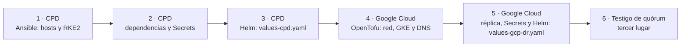

import EstadoCapacidad from '@site/src/components/EstadoCapacidad';

# Instalación

Nexo se instala en Kubernetes con los mismos instaladores en todos los ambientes: un chart Helm con valores por ambiente, un playbook de Ansible que arma el clúster RKE2 del CPD y un módulo de OpenTofu que crea el sitio de respaldo en Google Cloud.

| Instalador | Estado | En el repositorio |
| --- | --- | --- |
| Chart Helm `nexo-platform` | <EstadoCapacidad id="helm" /> | `deploy/helm/nexo-platform` |
| CPD: RKE2 sobre vSphere | <EstadoCapacidad id="instalador-rke2" /> | `deploy/ansible/rke2` |
| Google Cloud: GKE | <EstadoCapacidad id="instalador-gke" /> | `deploy/opentofu/gcp-dr` |
| Despliegue declarativo | <EstadoCapacidad id="gitops" /> | Todavía no |
| Gestión de secretos | <EstadoCapacidad id="secretos" /> | El chart solo referencia Secrets existentes |

:::caution Todavía sin instalación real

Los tres instaladores pasan las validaciones automáticas (ver [Validar sin clúster](#validar)), pero todavía no se han ejecutado contra un clúster ni contra un proyecto de Google Cloud. Úselos para revisar el diseño y en ambientes de prueba.

:::

## Qué instala el chart

Un solo release instala la plataforma en un espacio de nombres:

- **WSO2 API Manager 4.7.0** separado en Control Plane (portales, REST API, Key Manager y centro de eventos), Traffic Manager (límites de uso) y un Universal Gateway por audiencia: `operadores` (ambientes interno y de operadores) y `publico`. Cada gateway tiene su Deployment, su Service, su Ingress y su autoescalamiento.
- **WSO2 Micro Integrator 4.6.0**, con autoescalamiento.
- **Capa Yago:** Consola (API y web), motores, división de tráfico (Envoy, configurado por xDS desde los motores) y el agente de continuidad del sitio.
- El registro de Keycloak como Key Manager (tarea que corre después de cada instalación o actualización).
- La configuración de WSO2 (`deployment.toml`) generada desde los valores, políticas de red con todo denegado por omisión, presupuestos de interrupción, antiafinidad, sondas de salud y, si el clúster tiene Prometheus Operator, los ServiceMonitor.

El chart **no** instala las dependencias con estado: PostgreSQL, RabbitMQ, OpenSearch y Keycloak se consumen como servicios. PostgreSQL puede crearse con el operador CloudNativePG desde el mismo chart (opción desactivada por omisión).

## Orden de instalación



1. [CPD con RKE2](./cpd-rke2.md): máquinas virtuales, Kubernetes y la plataforma de producción.
2. [Google Cloud con GKE](./gcp-gke.md): sitio de respaldo en espera tibia.
3. [Valores por ambiente](./valores-por-ambiente.md): réplicas y recursos de producción, respaldo, QA y desarrollo.

QA y desarrollo usan el mismo chart en un clúster no productivo, cada uno en su espacio de nombres (`nexo-qa` y `nexo-dev`) y con sus propias credenciales.

## Requisitos comunes

- **Imágenes** en el registro del sitio (`global.imageRegistry`): `nexo/apim-cp`, `nexo/apim-tm`, `nexo/apim-gateway`, `nexo/apim-dbinit`, `nexo/mi`, `nexo/console-api`, `nexo/console-web` y `nexo/motores`, más Envoy y Fluent Bit sin cambios. Las de WSO2 se construyen con la misma receta del laboratorio: la imagen oficial más el controlador JDBC de PostgreSQL y el exportador de métricas.
- **Servicios externos:** PostgreSQL con las bases `apim_db`, `shared_db`, `nexo` y `mi_db`; RabbitMQ; OpenSearch; Keycloak de la institución con el reino de Nexo y el cliente técnico `wso2-km`; Prometheus y Alertmanager; colector de OpenTelemetry; etcd para el quórum de continuidad.
- **Nombres y certificados:** los nombres públicos (portales, gateways y Consola) con su certificado TLS, y una CA interna que firme los certificados de WSO2.
- **Secrets** creados antes de instalar. El chart no guarda contraseñas: solo nombra los Secrets (`existingSecret`). La lista completa está en el README del chart y en [Valores por ambiente](./valores-por-ambiente.md#secrets).

## Validar sin clúster {#validar}

```bash
deploy/validar-instaladores.sh             # usa las herramientas instaladas
deploy/validar-instaladores.sh --instalar  # antes instala las que falten en ~/.local/bin
```

El script revisa, sin conectarse a ningún clúster ni a Google Cloud:

| Parte | Revisión |
| --- | --- |
| Chart | `helm lint --strict` con cada archivo de valores; `helm template` validado con `kubeconform -strict` contra Kubernetes 1.36 (las CRD, con el catálogo de esquemas de CRD), incluidas las variantes con CloudNativePG e Ingress de GKE; cada `deployment.toml` generado debe ser TOML válido. |
| Ansible | `ansible-playbook --syntax-check` y `ansible-lint` con el perfil `production`. |
| OpenTofu | `tofu fmt -check`, `tofu init -backend=false`, `tofu validate` y `tofu test` con el proveedor de Google simulado. |

## Pendiente {#pendiente}

Lo que falta para la primera instalación real, además de ejecutarla:

- **Imágenes de producción derivadas de WSO2.** El workflow de versión ya construye, firma (Sigstore) y publica `nexo-console-api`, `nexo-console-web` y `nexo-motores`; las imágenes de API Manager, gateway y Micro Integrator siguen la receta de los Dockerfile del laboratorio y todavía no se publican en cada versión.
- **Coordinación del integrador.** Con dos o más réplicas de Micro Integrator, los consumidores de colas marcados como coordinados corren en todas las réplicas, porque la coordinación de clúster del integrador aún no se configura.
- **Artefactos de integración por ambiente.** Los de ejemplo apuntan a nombres del laboratorio; en cada ambiente se parametrizan con variables.
- **Promoción con CloudNativePG** en el sitio de respaldo (ver [Google Cloud con GKE](./gcp-gke.md#pendiente)).
