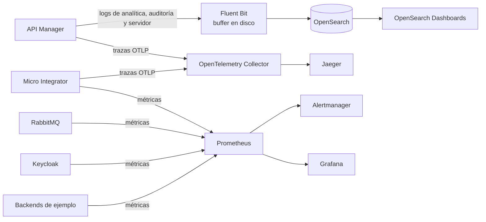

import Accesos from './_generated/accesos-laboratorio.md';
import Comandos from './_generated/comandos-laboratorio.md';
import Hosts from './_generated/hosts-laboratorio.md';
import Observabilidad from './_generated/observabilidad-laboratorio.md';
import Servicios from './_generated/servicios-laboratorio.md';
import Variables from './_generated/variables-bootstrap.md';
import EstadoCapacidad from '@site/src/components/EstadoCapacidad';

# Laboratorio

Estado: <EstadoCapacidad id="laboratorio" />

El laboratorio levanta en un solo equipo la base de Nexo con Docker Compose: WSO2 API Manager 4.7.0 sobre PostgreSQL, WSO2 Micro Integrator 4.6.0, Keycloak, RabbitMQ y backends de ejemplo con datos sintéticos. Dos perfiles opcionales agregan la observabilidad (`obs`) y una plataforma existente simulada con APISIX y NGINX (`legacy`). Sirve para desarrollo, pruebas y demostraciones.

:::caution Solo para laboratorio

Usa credenciales de ejemplo, el certificado autofirmado de la distribución de WSO2 y Keycloak en modo desarrollo (HTTP). No lo exponga a redes no confiables ni lo use con datos reales.

:::

## Requisitos

- Docker Engine con Docker Compose v2 (comando `docker compose`).
- GNU Make.
- Node.js 22 o superior y pnpm 10 (el repositorio declara `pnpm@10.28.0`; con Corepack basta `corepack enable`).
- Conexión a Internet la primera vez: se descargan las imágenes de contenedores y los controladores que se agregan a las imágenes de WSO2.
- Permisos de administrador (sudo) solo para `make hosts`.
- Memoria holgada: con todos los perfiles corren todos los servicios de la [tabla de servicios](#servicios-y-puertos), entre ellos WSO2 API Manager y OpenSearch. Todavía no hay una medición publicada de requisitos mínimos; si el equipo es justo, levante solo el núcleo con `make -C deploy/compose core`.

## Puesta en marcha

Desde la raíz del repositorio:

```bash
# 1. Dependencias y bibliotecas compiladas (los backends de ejemplo usan @nexo/shared
#    y el arranque usa @nexo/wso2-client, ambos desde su carpeta dist/)
pnpm install
pnpm --filter @nexo/shared --filter @nexo/wso2-client build

# 2. Variables del laboratorio (credenciales solo de ejemplo)
cp deploy/compose/.env.example deploy/compose/.env

# 3. Nombres de los servicios en /etc/hosts (una sola vez; pide sudo)
make -C deploy/compose hosts

# 4. Construir y levantar: núcleo + perfiles obs y legacy
make -C deploy/compose up

# 5. Revisar el estado hasta que apim y keycloak aparezcan sanos (healthy)
make -C deploy/compose status

# 6. Configurar WSO2 y Keycloak y ejecutar la prueba de punta a punta
make -C deploy/compose bootstrap
```

Notas:

- `make up` primero compila los backends de ejemplo y construye las imágenes locales (`make build`); si falta `deploy/compose/.env`, lo crea desde `.env.example`.
- La primera vez, API Manager puede tardar varios minutos en quedar sano.
- `make hosts` agrega esta línea a `/etc/hosts`:

<Hosts />

### Perfiles

| Perfil | Qué agrega |
| --- | --- |
| núcleo (siempre) | PostgreSQL, Keycloak, WSO2 API Manager, WSO2 Micro Integrator, RabbitMQ y backends de ejemplo. |
| `obs` | OpenTelemetry Collector, Jaeger, Prometheus, Alertmanager, Grafana, OpenSearch, OpenSearch Dashboards y Fluent Bit. |
| `legacy` | APISIX (con etcd) y NGINX con APIs no gobernadas, que simulan una plataforma existente. |

Por omisión, `make up` levanta los dos perfiles. Para elegir, pase la variable `PROFILES`, y use el mismo valor en `down`, `status` y `logs`:

```bash
make -C deploy/compose up PROFILES="--profile obs"   # núcleo + observabilidad
make -C deploy/compose core                          # solo el núcleo
```

## Qué hace y qué verifica el arranque

`make bootstrap` ejecuta `tools/lab-bootstrap` (`pnpm --filter @nexo/lab-bootstrap start`). Es idempotente: se puede ejecutar varias veces. Primero espera hasta 5 minutos a que responda Keycloak y otros 5 a que responda API Manager, y luego:

1. **Keycloak.** Crea, si falta, el scope `default` en el realm `nexo`, lo deja como scope por omisión y lo asigna al cliente `wso2-km`.
2. **Key Manager.** Registra Keycloak como Key Manager de API Manager (nombre `Keycloak`), con los endpoints del realm `nexo`.
3. **API de ejemplo.** Importa la API `Concesiones` 1.0.0 desde su contrato OpenAPI, con contexto `/concesiones` y el backend de ejemplo como destino; crea una revisión, la despliega en el gateway y publica la API.
4. **Aplicación.** En el Dev Portal crea la aplicación `OperadorDemo`, genera sus llaves de producción en Keycloak (grant `client_credentials`) y la suscribe a la API.
5. **Prueba de punta a punta.**
   - Pide un token a Keycloak con las llaves de la aplicación.
   - Llama a `https://apim:8243/concesiones/1.0.0/concesiones?estado=vigente` con ese token y **exige una respuesta 200**. Reintenta hasta 20 veces, cada 5 segundos; si no obtiene 200, termina con error.
   - Repite la llamada **sin token** y muestra el código que devuelve el gateway, que debe ser **401**.

Al final, la salida incluye estas dos líneas (el total depende de los datos sintéticos):

```text
[bootstrap] PRUEBA DE PUNTA A PUNTA OK: gateway → backend {"status":200,"total":<n>,"version":"1.0.0"}
[bootstrap] Sin token el gateway rechaza la llamada {"status":401}
```

El arranque acepta estas variables de entorno. `make bootstrap` **no lee** `deploy/compose/.env`: si cambió alguna credencial, expórtela antes de ejecutarlo.

<Variables />

## Servicios y puertos {#servicios-y-puertos}

Puertos publicados en el equipo, tal como los define `deploy/compose/docker-compose.yml`:

<Servicios />

## Accesos principales

<Accesos />

- Las URL con `apim` y `keycloak` necesitan `make hosts`: los portales de WSO2 y Keycloak redirigen a esos nombres.
- Las credenciales están en `deploy/compose/.env`. El administrador de API Manager, de Keycloak y de Grafana es `admin`; el usuario de RabbitMQ es `nexo`.
- El realm `nexo` de Keycloak trae un usuario de ejemplo por cada rol de Nexo, para pruebas.

## Comandos

<Comandos />

## Qué se puede observar {#que-se-puede-observar}

Con el perfil `obs`:



<Observabilidad />

- **Grafana** trae aprovisionados los orígenes de datos Prometheus y Jaeger. Los tableros de Nexo están en estado <EstadoCapacidad id="tableros" />.
- **Trazas:** el colector elimina el encabezado `Authorization` de los atributos de las trazas y reemplaza el identificador de usuario final por un hash antes de enviarlas a Jaeger.

## Detener y limpiar

```bash
make -C deploy/compose down    # detiene y elimina los contenedores; conserva los datos
make -C deploy/compose clean   # además borra los volúmenes (bases de datos, colas, índices)
```

## Solución de problemas

**El arranque termina con «Keycloak no respondió en 300s».** El equipo no resuelve el nombre `keycloak` (o Keycloak aún no inicia). Ejecute `make -C deploy/compose hosts` y revise `make -C deploy/compose status`. El arranque usa por omisión `https://apim:9443`, `https://apim:8243` y `http://keycloak:8080` porque registra esas mismas URL en WSO2, que las resuelve dentro de la red de Docker; no las cambie por `localhost`.

**El arranque termina con «API Manager no respondió en 300s».** API Manager todavía está iniciando. Revise `make -C deploy/compose logs S=apim` y vuelva a ejecutar `make -C deploy/compose bootstrap`: es idempotente.

**`make up` falla al compilar `@nexo/demo-backends`.** Falta compilar `@nexo/shared` (paso 1 de la puesta en marcha). Del mismo modo, `make bootstrap` necesita `@nexo/wso2-client` compilado.

**Cambié contraseñas en `.env` y los servicios no se conectan.** Las bases y usuarios de PostgreSQL se crean solo cuando se inicializa su volumen. Borre los volúmenes con `make -C deploy/compose clean`, levante de nuevo y exporte las mismas variables antes de `make bootstrap`.

**Un puerto ya está en uso.** El laboratorio publica muchos puertos (ver [Servicios y puertos](#servicios-y-puertos)). Libere el puerto o levante menos perfiles.

**El navegador advierte sobre el certificado.** API Manager usa el certificado autofirmado de su distribución. En el laboratorio se puede aceptar; el arranque lo acepta solo para estas pruebas.

**Prometheus muestra destinos caídos.** Si el destino corresponde a un servicio de Nexo que todavía no forma parte del laboratorio, es esperado que aparezca caído y active la alerta de componente caído (ver [Qué se puede observar](#que-se-puede-observar)).

**Ver los logs de un servicio:** `make -C deploy/compose logs S=<servicio>`, por ejemplo `S=apim` o `S=keycloak`.
