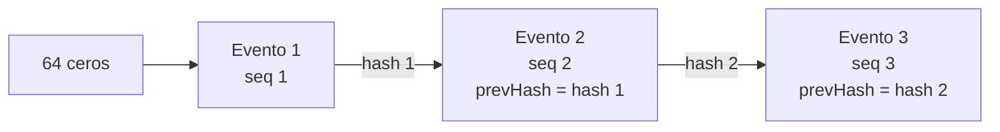

import CuatroOjos from './_generated/cuatro-ojos.md';
import KeycloakLaboratorio from './_generated/keycloak-laboratorio.md';
import MatrizRoles from './_generated/matriz-roles.md';
import Roles from './_generated/roles.md';
import Contacto from '@site/src/components/Contacto';
import EstadoCapacidad from '@site/src/components/EstadoCapacidad';

# Seguridad

Resumen del modelo de seguridad de Nexo. Cada parte indica si ya existe o si está en desarrollo.

| Ámbito | Qué hace Nexo | Estado |
| --- | --- | --- |
| Identidad de aplicaciones | Keycloak como Key Manager: credenciales y tokens OAuth 2.0 que el gateway valida. | <EstadoCapacidad id="keycloak-key-manager" /> |
| Inicio de sesión de personas | Portales de WSO2 y Consola Nexo con el Keycloak de la institución (OIDC). | <EstadoCapacidad id="sso-keycloak" /> |
| Mínimo privilegio | Seis roles con una matriz rol-permiso única y acciones de cuatro ojos. | <EstadoCapacidad id="nexo-shared" /> (biblioteca) · <EstadoCapacidad id="consola" /> (aplicación en la Consola) |
| Auditoría íntegra | Eventos con secuencia y hash encadenado, verificables. | <EstadoCapacidad id="nexo-shared" /> (biblioteca) · <EstadoCapacidad id="auditoria-centralizada" /> (envío al SIEM y verificación en la Consola) |
| Datos personales en logs | Enmascaramiento de RUT, correos y teléfonos. | <EstadoCapacidad id="enmascaramiento-logs" /> |
| Secretos | Gestor de secretos para producción; sin secretos en el código. | <EstadoCapacidad id="secretos" /> |

## Identidad y acceso

Nexo no administra usuarios propios: usa el **Keycloak de la institución**.

- **Aplicaciones consumidoras.** Keycloak es el Key Manager de API Manager. En el laboratorio, cada aplicación obtiene sus credenciales y sus tokens OAuth 2.0 desde Keycloak, y el gateway valida esos tokens antes de dejar pasar una llamada (ver el [flujo de una llamada](./arquitectura.md#flujo-de-una-llamada)).
- **Personas.** Publisher, Dev Portal, Admin y la Consola Nexo usarán el inicio de sesión del Keycloak de la institución (OIDC; la Consola, con PKCE). El realm del laboratorio ya define los clientes para ello. Los roles se asignan por grupos de Keycloak.
- **Políticas de contraseñas, bloqueo y sesiones.** Las define el Keycloak de la institución. Como referencia, el realm del laboratorio usa:

<KeycloakLaboratorio />

## Mínimo privilegio y segregación de funciones {#minimo-privilegio}

Nexo define seis roles y una **matriz rol-permiso única**, escrita en código en la biblioteca `@nexo/shared` (`packages/shared/src/roles.ts`) y cubierta por pruebas unitarias. La API de la Consola la usará para autorizar cada acción y la Consola la exportará como documento de cumplimiento. Las tablas de esta sección se generan desde esa misma matriz al construir el sitio, así que siempre coinciden con el código.

### Roles

<Roles />

### Matriz rol-permiso {#matriz-rol-permiso}

<MatrizRoles />

### Acciones de cuatro ojos

Quien inicia una de estas acciones no puede aprobarla: la API verificará que quien aprueba sea una persona distinta de quien inició. Toda acción no permitida se rechazará y quedará auditada.

<CuatroOjos />

## Auditoría con cadena de hash {#auditoria}

Cada evento de auditoría registra quién hizo qué, sobre qué recurso, con qué resultado, cuándo y desde dónde. Además, los eventos de una misma fuente forman una **cadena**: cada uno incluye el hash del anterior. Así se puede comprobar, por ejemplo en el SIEM, que llegaron todos, en orden y sin alteraciones.

| Campo | Contenido |
| --- | --- |
| `source` | Fuente que emite el evento (por ejemplo, la Consola). |
| `actor`, `actorType` | Identidad que actúa y su tipo: `usuario` o `tecnico`. |
| `action`, `resource` | Acción y recurso afectado. |
| `result` | `exito`, `rechazado` o `error`. |
| `sourceIp`, `correlationId` | IP de origen e identificador para correlacionar con trazas (opcionales). |
| `details` | Datos adicionales (opcional). |
| `id`, `ts` | Identificador único (UUID) y fecha y hora en formato ISO 8601. |
| `seq` | Número de secuencia dentro de la fuente: 1, 2, 3… |
| `prevHash` | Hash del evento anterior de la misma fuente; para el primero, 64 ceros. |
| `hash` | SHA-256 de `prevHash` seguido del evento en forma canónica. |

**Forma canónica.** El evento, sin el campo `hash`, se serializa como JSON con las claves en orden alfabético, sin espacios y sin campos vacíos. Así el mismo evento produce siempre el mismo hash.

**Verificación.** Se recorren los eventos de una fuente en orden y se detectan tres tipos de falla:

| Falla | Qué significa |
| --- | --- |
| `secuencia` | Falta un evento o llegaron desordenados (hay un salto en `seq`). |
| `encadenamiento` | El `prevHash` de un evento no coincide con el hash del anterior. |
| `hash` | El contenido de un evento fue alterado: su hash no corresponde. |

El esquema, el encadenamiento y la verificación están implementados en `packages/shared/src/audit.ts` y probados en `packages/shared/src/shared.test.ts` (cadena íntegra, evento alterado y hueco en la secuencia): <EstadoCapacidad id="nexo-shared" />. En el laboratorio, Fluent Bit ya envía la auditoría de API Manager a OpenSearch con buffer en disco. La cadena aplicada a todas las fuentes, el envío al SIEM de la institución y la verificación desde la Consola están en estado <EstadoCapacidad id="auditoria-centralizada" />.

## Cifrado en tránsito (TLS) {#tls}

**Política de Nexo:**

- Solo **TLS 1.2 y TLS 1.3** en los canales HTTPS.
- En producción, certificados emitidos por la autoridad certificadora de la institución y TLS mutuo (mTLS) entre componentes internos.
- La Consola publicará la matriz de canales y la configuración criptográfica observada.

**En el laboratorio:**

- API Manager limita a TLS 1.2 y 1.3 el puerto de portales y REST API (9443) y el gateway HTTPS (8243), según `deploy/compose/apim/config/repository/conf/deployment.toml`.
- API Manager usa el certificado autofirmado de su distribución; el arranque del laboratorio lo acepta solo para pruebas.
- Keycloak corre en modo desarrollo, por HTTP. No es una configuración apta para producción.

La configuración de producción (certificados de la institución y mTLS interno) se entrega con los instaladores: <EstadoCapacidad id="helm" />.

## Secretos {#secretos}

- **Ningún secreto en el código.** El CI del repositorio ejecuta Gitleaks en cada push y pull request.
- **Laboratorio.** Las credenciales de ejemplo están en `deploy/compose/.env.example`, permitido de forma explícita en `.gitleaks.toml`. El archivo `.env` real está excluido de Git.
- **Producción.** OpenBao con External Secrets Operator y WSO2 Secure Vault, con rotación auditada: <EstadoCapacidad id="secretos" />.

## Datos personales

- **Solo datos sintéticos en pruebas y demostraciones.** `@nexo/shared` incluye un generador determinista de datos ficticios (RUT válidos, nombres, correos `@ejemplo.invalid`): <EstadoCapacidad id="nexo-shared" />.
- **Minimización en trazas.** En el laboratorio, el colector OpenTelemetry elimina el encabezado `Authorization` de los atributos de las trazas y reemplaza el identificador de usuario final por un hash.
- **Enmascaramiento en logs y auditoría:** <EstadoCapacidad id="enmascaramiento-logs" />.

## Desarrollo seguro

- Lint, tipos, pruebas y build en el CI en cada push y pull request.
- Gitleaks (secretos) y Trivy (dependencias, secretos y configuración). Trivy hoy es informativo: reporta, pero no detiene el CI.
- SBOM CycloneDX y firma de imágenes por versión: <EstadoCapacidad id="sbom" />.

## Reporte de vulnerabilidades {#reporte-de-vulnerabilidades}

Si encuentra una vulnerabilidad en Nexo (código de Yago o configuración de la distribución), escríbanos a <Contacto tipo="seguridad" />.

**Incluya, si puede:**

- qué encontró y qué efecto puede tener;
- versión de Nexo (o commit) y componente afectado;
- pasos para reproducirla o una prueba de concepto;
- cómo contactarlo.

**Le pedimos:**

- no divulgarla públicamente hasta que exista una corrección y acordemos la fecha con usted;
- probar solo en su propio laboratorio, sin afectar servicios ni datos de terceros;
- no acceder, modificar ni conservar datos que no le pertenecen.

**Nosotros:**

- acusamos recibo y evaluamos el reporte con la [matriz de severidades](./ciclo-de-vida-y-soporte.md#severidades): una vulnerabilidad explotable activamente en un componente expuesto se trata como severidad S2;
- le informamos el avance y la versión que la corrige;
- publicamos un aviso de seguridad en [Novedades](/novedades) junto con la versión corregida y, si lo desea, reconocemos su aporte.

Si la vulnerabilidad está en un componente de terceros (por ejemplo, WSO2 API Manager o Keycloak), repórtela también al proyecto correspondiente según su propia política. Yago incorpora esas correcciones en Nexo según su [política de parches](./ciclo-de-vida-y-soporte.md#parches).
